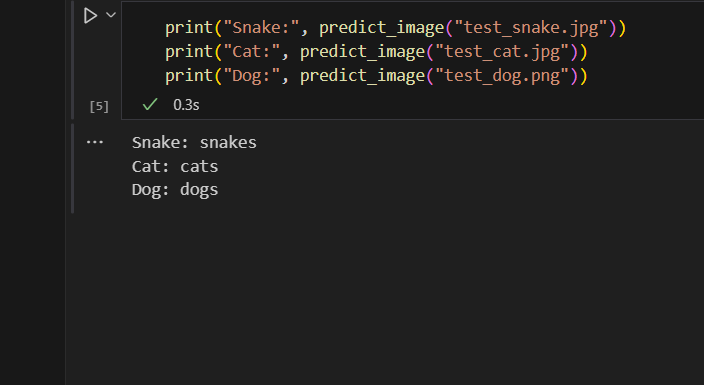

# 🐶🐱🐍 Dogs-Cats-Snakes Image Classifier

  

## Project Overview
This is my **first deep learning project**, where I implemented an image classifier capable of distinguishing between **dogs, cats, and snakes** using a **pretrained ResNet18 model** in PyTorch. The model is fine-tuned on a custom dataset and achieves **95.6% validation accuracy**, demonstrating the fundamentals of **computer vision** and **transfer learning**.

---

## Features
- Fine-tuned **ResNet18** pretrained on ImageNet.  
- Dataset automatically split into **train (80%)** and **validation (20%)**.  
- Validation accuracy tracked using **TorchMetrics**.  
- Best model saved automatically during training (`best_model.pth`).  
- Inference script available for testing new images.  

---

## Dataset
- The dataset is large and will be provided via **download link**:  
[Download Dataset](https://www.kaggle.com/datasets/borhanitrash/animal-image-classification-dataset)  
- After downloading, extract the folder. The folder structure should remain as:  
```
dogs/
cats/
snakes/
```  
- The dataset will be split automatically during training.

---

## Requirements
- Python 3.8+  
- PyTorch  
- Torchvision  
- TorchMetrics  
- Pillow  

Install requirements:
```bash
pip install torch torchvision torchmetrics pillow
```

---

## Training
```python
# Load dataset, define transforms
# Load pretrained ResNet18
# Define loss, optimizer, metric
# Train the model and save best weights
python train.py
```

- Tracks **loss** and **validation accuracy** each epoch.  
- Best model saved as `best_model.pth`.  

---

## Inference
```python
from inference import predict_image

print(predict_image("test_snake.png"))  # → snakes
print(predict_image("test_cat.png"))    # → cats
print(predict_image("test_dog.png"))    # → dogs
```

- Preprocessing must match training transforms.  
- Class names are automatically mapped from training dataset.  

---

## Results
- **Validation accuracy achieved:** 95.6% ✅  
- Predictions are consistent and reliable for dogs, cats, and snakes.  

**Example Predictions:**  
  


---

## Future Improvements
- Experiment with **stronger pretrained models** (ResNet50, EfficientNet).  
- Add **data augmentation** for better generalization.  
- Deploy online with a **web front-end**.  
- Support **batch inference** or **confidence scores** for predictions.

